# Traceable RAG Query Pipeline

This document specifies one query turn, including GraphRAG, SSE delivery, and
chat persistence. Stable component boundaries are defined in `architecture.md`.

> Endpoint: `POST /ai_search/?session_id=<id>`, body `ChatRequest`, response
> `text/event-stream`. The API route validates and encodes; `pipeline/query.py`
> owns the turn. Explicit **Current limitation** notes describe implemented
> behavior that remains incomplete.

## TARGET DESIGN — the loop and the state

The professional path repeats intent, planning, execution, reranking, and
evaluation until sufficient or bounded. The casual path bypasses this loop.

### One turn is a loop, not a line

```mermaid
flowchart TD
    REQUEST["Frontend POST /ai_search with session_id and ChatRequest<br/>Deep Search control is compiled but hidden"]

    subgraph API["API trust boundary"]
        AUTH["Verify JWT signature, user row, and auth_version"]
        OWNER["Verify session exists and belongs to authenticated user"]
        VALIDATE["Trim question and enforce non-empty and length bounds"]
        POLICY["Resolve TurnOptions: web_search true becomes FORCE, false becomes AUTO, policy may force DISABLED; record requested deep_research but force effective false"]
        JOB["Mint frozen QueryJob: run_id, user_id, session_id, question, authorization, options"]
        HTTPFAIL["HTTP 401, 404, or 422; SSE is not opened"]
    end

    REQUEST --> AUTH
    AUTH -->|valid| OWNER
    AUTH -->|invalid| HTTPFAIL
    OWNER -->|owned| VALIDATE
    OWNER -->|missing or foreign| HTTPFAIL
    VALIDATE -->|valid| POLICY
    VALIDATE -->|invalid| HTTPFAIL
    POLICY --> JOB

    subgraph ORCHESTRATOR["QueryPipeline owns one turn"]
        ROUTE["API route calls QueryPipeline.stream(job)"]
        STATE["Pipeline constructs mutable AgentState(job=job)"]
        DEADLINE["Apply one TURN_TIMEOUT_S deadline to classification, retrieval, and answer"]
        SCENARIO["Intent slot: analyze_chat_scenario(original question); invalid or failure defaults to professional"]
        PATH{"Scenario starts with casual?"}
    end

    JOB --> ROUTE --> STATE --> DEADLINE --> SCENARIO --> PATH

    subgraph CASUAL["Casual path"]
        CASWEB{"Web mode is FORCE, or AUTO with casual_web?"}
        CASPLAN["Build a one-call WEB_SEARCH Plan; no planner slot call"]
        CASCONTEXT["Successful web result remains typed RetrievedChunk context; failure becomes empty context"]
        CASHISTORY["Load prior user questions and build DirectAnswerPrompt"]
        CASANSWER["Answer slot: casual_chat_completion with turbo chat model"]
        CASFRAMES["Stream assistant token frames"]
    end

    PATH -->|yes: casual or casual_web| CASWEB
    CASWEB -->|yes| CASPLAN
    CASWEB -->|no| CASHISTORY
    CASCONTEXT --> CASHISTORY --> CASANSWER --> CASFRAMES

    subgraph PROFESSIONAL["Professional retrieval loop"]
        QUERIES["Current queries: original question in round 0, refined queries later"]
        INTENT["Intent slot: analyze_query_intent(current query list) returns Intent"]
        PLANNER["Planner slot: agent_plan selects only installed and authorized tools using effective web mode and session context"]
        PLAN["Typed Plan of ToolCalls; each call carries the current query list"]
        APPEND["Append every ToolResult to AgentState.tool_results"]
        GATHER["Flatten accumulated chunks and deduplicate by chunk id"]
        RERANK["Reranker slot: score against original question, clamp, threshold, sort, and keep RERANK_TOP_N"]
        RANKED["Replace AgentState.ranked with selected chunks"]
        EVALUATE["Evaluator slot: evaluate_context_sufficiency(ranked, original question)"]
        SUFFICIENT{"Evaluator policy: score is above SUFFICIENT_THRESHOLD?"}
        ROUNDLEFT{"run.round + 1 is below MAX_ROUNDS?"}
        REFLECT["Evaluator slot: reflection proposes gap-filling queries"]
        REFINED{"At least one refined query returned?"}
        ADVANCE["Increment run.round and replace current queries"]
        PROPREP["Keep ranked chunks typed, assign a separate citation-ID map, load prior user questions, and collect web questions and media"]
        PROANSWER["Answer slot: get_chat_completion with primary chat model"]
        PROFRAMES["Stream documents and web frames, assistant tokens, recommendations, media, and citations"]
    end

    PATH -->|no: professional| QUERIES
    QUERIES --> INTENT --> PLANNER --> PLAN
    APPEND --> GATHER --> RERANK --> RANKED --> EVALUATE --> SUFFICIENT
    SUFFICIENT -->|yes| PROPREP
    SUFFICIENT -->|no| ROUNDLEFT
    ROUNDLEFT -->|no| PROPREP
    ROUNDLEFT -->|yes| REFLECT --> REFINED
    REFINED -->|yes| ADVANCE --> QUERIES
    REFINED -->|no| PROPREP
    PROPREP --> PROANSWER --> PROFRAMES

    subgraph EXECUTION["Executer slot and the only tool gateway"]
        TOOLCTX["Derive frozen ToolContext with run_id, user_id, and session_id from QueryJob"]
        EXECUTER["Concurrent executer: one task per planned ToolCall with TOOL_TIMEOUT_S"]
        AUTHZ{"ToolRegistry authorization re-check for this call"}
        QUERYFAN["Run every query in the authorized ToolCall concurrently"]
        TOOLERROR["Error ToolResult for policy denial, timeout, or tool failure; sibling calls continue"]

        RAG["RAG tool"]
        RAGEMBED["Build configured embedder off-loop; await query embedding; close provider"]
        RAGDB["Elasticsearch hybrid BM25 plus kNN search scoped by user_id; BM25 is the kNN filter"]
        RAGNORM["Normalize hits as RetrievedChunk; retain encoded string ref_images"]

        GRAPH["GraphRAG tool"]
        GRAPHREPO["Load the per-user read-only GraphRepository off the event loop"]
        KEYWORDS["Extract high-level and low-level keywords"]
        HASENTITY{"Low-level keywords?"}
        ENTITY["Await entity-query embedding; search node vectors to entity top-K; load graph-node metadata"]
        HASRELATION{"High-level keywords?"}
        RELATION["Await relation-query embedding; search edge vectors to relation top-K; load graph-edge metadata"]
        SOURCEIDS["Collect and order-deduplicate graph source_id chunk IDs"]
        HASIDS{"Any source chunk IDs?"}
        GRAPHDB["One Elasticsearch mget retrieves authoritative source chunks in requested-ID order"]
        GRAPHNORM["Normalize nonblank chunks; retain encoded string ref_images; missing IDs are omitted"]

        WEB["web_search tool"]
        WEBTEXT["Configured provider returns text hits and related questions"]
        WEBRANK["Configured embedder ranks bounded snippets by in-memory cosine; provider order is the fallback"]
        WEBMEDIA["Best-effort provider image and video lookup; failure returns empty media"]
        WEBMERGE["Merge web chunks, related questions, images, and videos"]

        DIRECT["LLM tool"]
        SESSIONCTX["Read attached context for ToolContext.session_id"]
        DIRECTMODEL["Direct LLM completion produces a current-context chunk"]

        CALLRESULT["Merge per-query outputs into one typed ToolResult per ToolCall"]
        RESULTS["Executer returns ToolResults in Plan order"]
        RETURNPATH{"Return to the path that scheduled the Plan"}
    end

    STATE -.-> TOOLCTX
    CASPLAN --> EXECUTER
    PLAN --> EXECUTER
    TOOLCTX --> EXECUTER
    EXECUTER --> AUTHZ
    EXECUTER -->|timeout| TOOLERROR
    AUTHZ -->|denied| TOOLERROR
    AUTHZ -->|allowed| QUERYFAN
    QUERYFAN -->|RAG call| RAG --> RAGEMBED --> RAGDB --> RAGNORM --> CALLRESULT
    QUERYFAN -->|GraphRAG call| GRAPH --> GRAPHREPO --> KEYWORDS --> HASENTITY
    HASENTITY -->|yes| ENTITY --> HASRELATION
    HASENTITY -->|no| HASRELATION
    HASRELATION -->|yes| RELATION --> SOURCEIDS
    HASRELATION -->|no| SOURCEIDS
    SOURCEIDS --> HASIDS
    HASIDS -->|yes| GRAPHDB --> GRAPHNORM --> CALLRESULT
    HASIDS -->|no| CALLRESULT
    QUERYFAN -->|web_search call| WEB
    WEB --> WEBTEXT --> WEBRANK --> WEBMERGE
    WEB --> WEBMEDIA --> WEBMERGE
    WEBMERGE --> CALLRESULT
    QUERYFAN -->|LLM call| DIRECT --> SESSIONCTX --> DIRECTMODEL --> CALLRESULT
    QUERYFAN -->|exception or returned error| TOOLERROR
    CALLRESULT --> RESULTS
    TOOLERROR --> RESULTS
    RESULTS --> RETURNPATH
    RETURNPATH -->|casual web| CASCONTEXT
    RETURNPATH -->|professional round| APPEND

    subgraph COMPLETION["Persistence and SSE completion"]
        TRACE["Pipeline emits TraceStep and Evidence updates while work runs"]
        PERSIST["Answer slot inserts the message, commits, then conditionally names the session"]
        SAVED{"Message insert and session naming both succeed?"}
        ENDFRAME["Answer slot creates event end with DONE"]
        FINALIZE["Pipeline finalizes AgentState.answer before forwarding DONE; professional path also closes the answer step"]
        ANSWERERROR["Sanitized event error; DONE is suppressed"]
        TURNERROR["Route logs timeout or uncaught failure and emits event error with run_id"]
        SSE["API route encodes step and evidence events plus legacy progress; answer frames pass through verbatim"]
        RESPONSE["StreamingResponse text/event-stream"]
    end

    QUERIES -.-> TRACE
    CASWEB -.-> TRACE
    PROANSWER -.-> TRACE
    CASFRAMES --> PERSIST
    PROFRAMES --> PERSIST
    CASANSWER -->|provider failure| ANSWERERROR
    PROANSWER -->|provider failure| ANSWERERROR
    PERSIST --> SAVED
    SAVED -->|yes| ENDFRAME --> FINALIZE
    SAVED -->|no; insert may already have committed if naming failed| ANSWERERROR
    DEADLINE -->|timeout or uncaught failure| TURNERROR
    TRACE --> SSE
    CASFRAMES --> SSE
    PROFRAMES --> SSE
    FINALIZE --> SSE
    ANSWERERROR --> SSE
    TURNERROR --> SSE
    SSE --> RESPONSE
```



The evaluator returns refined search queries when context is insufficient.
Those queries re-enter intent and planning; an empty result ends the loop.

### One task, however many queries

`analyze_query_intent` accepts a query list and returns one `Intent`. A
`ToolCall` carries that list; the executor runs its queries concurrently and
merges them into one `ToolResult`.

### The state, and who is allowed to touch it

`AgentState` holds the turn: the original question, the intent, the plan, the
accumulated tool results, the ranked chunks, the round counter, the answer.

The pipeline reads and writes it. **The slots never see it.**

```python
# pipeline/query.py -- owns the state and orchestration
queries = [run.question]
while True:
    run.intent = await intent.analyze_query_intent(queries)
    run.plan = await planner.agent_plan(queries, run.intent, ...)
    run.tool_results.extend(await executer.run(run.plan, context=run.context, ...))
    merged = gather_results(run.tool_results)
    run.ranked = await rerank_results(merged, run.question, top_n, reranker=self.reranker) if merged else []
    run.evaluation = await evaluator.evaluate_context_sufficiency(
        run.ranked, run.question
    )
    if evaluator.is_sufficient(run.evaluation):
        break
    if run.round + 1 >= settings.max_rounds:
        break
    queries = await evaluator.reflection(
        run.question, run.ranked, run.evaluation, ...
    )
    if not queries:
        break
    run.round += 1
```

**Inputs come from explicit arguments.** Slot contracts name the current query
list, plan, chunks, original question, and execution context they require.

**Results accumulate.** A later round adds evidence to earlier results before
deduplication and reranking.

**The boundary is independently testable.** Each slot Protocol can be exercised
without constructing or mutating a complete turn.

### What the original question is for

Reflection replaces search queries, never `AgentState.question`. Reranking,
evaluation, prompting, and persistence continue to use the original question.

### Bounds

`AgentState.round` is the zero-based current-round index. `MAX_ROUNDS` (default
**2**, counting the initial search) is the ceiling and the loop enforces it, so
a reflection that keeps finding gaps stops after one extra round. Setting it to
1 disables reflection entirely. `TOOL_TIMEOUT_S` bounds each `ToolCall`
(default 120 seconds), while `TURN_TIMEOUT_S` bounds classification, retrieval,
and answer generation together (default 600 seconds).

---

## CORE WORKFLOW STEPS

### 1. SESSION AND USER VALIDATION (All scenarios)
- a. Verify JWT signature, user existence, and `auth_version`.
- b. Extract the server-authenticated `user_id`.
- c. Verify that `session_id` exists and belongs to the user.
- d. Trim and validate the question before opening the SSE response.
- e. Resolve `ALLOWED_TOOLS` and the requested web mode.
- f. Mint a frozen `QueryJob`; `pipeline/query.py` constructs `AgentState` and
  derives `ToolContext`. History is loaded later for answer prompting and is
  not summarized or length-limited.

### 2. CHAT SCENARIO RECOGNITION (Silent Backend Step)
- a. The configured intent slot first classifies the question for path
  selection. The default `llm` implementation calls the model again inside
  each professional-round intent analysis; the `keywords` implementation
  always chooses `professional`.
- b. Returns one of three scenarios:
  - **"casual"**: Pure conversation (greetings, personal chat, simple questions)
  - **"casual_web"**: Simple question requiring current public information
  - **"professional"**: Technical or document question requiring retrieval
- c. Invalid output or classifier failure defaults to `professional`.

### 3. WORKFLOW PATH SELECTION
- a. **If scenario starts with "casual"**:
  - Skip intent recognition and knowledge base search
  - Search the web when forced, or for `casual_web` in AUTO mode
  - Go directly to final answer generation with the turbo model
  - Use prior user questions and web search results as context
  - Persist before sending `[DONE]`

- b. **If scenario == "professional"**:
  - Run the bounded retrieval loop in steps 4-10
  - Continue to professional answer synthesis

### 4. QUERY INTENT RECOGNITION (Professional scenarios only)
- a. The intent slot analyzes all search queries for the current round.
- b. `Intent.intents` contains a list of knowledge-source strings:
  - `["web_search"]`: Search internet for current information
  - `["kb(filter)"]`: Search the user's knowledge base
  - `["session_context"]`: Use uploaded file context
  - Combinations: `["kb(filter)", "web_search"]` for complex queries

  > **Current limitation:** `kb(...)` is matched by prefix, so `kb(all)` and
  > `kb(doc123)` schedule retrieval, but the parenthesized value is not parsed or
  > passed as a document filter. The whole user's index is searched.

- c. Knowledge source examples:
  - "Tell me about machine learning algorithms" → `["kb(filter)"]`
  - "What's in the Tesla earnings report?" → `["kb(filter)"]`
  - "Compare our product with market trends" → `["kb(filter)", "web_search"]`

- d. A `kb...` intent requests RAG and GraphRAG; the planner retains only tools
  that are registered and authorized. Both return the user's document chunks
  with `source_type="knowledge_base"`.

### 5. ACTION PLAN SELECTION (Professional scenarios only)
- a. Build a typed `Plan` using only installed and authorized tools.
- b. Knowledge source to tool mapping:
  - `"kb(filter)"` → **RAG + GraphRAG**
  - `"web_search"` → **"web_search"** tool: Internet search for current information
  - `"session_context"` → **"LLM"** tool: Direct language model responses using session context
- c. Action plan structure:
  ```json
  {"calls": [{"tool_name": "RAG", "query": ["question or refined query"]}]}
  ```
- d. Session context integration:
  - Adds the LLM tool when the session has attached context text.
- e. Web mode is resolved once in the job:
  - **FORCE** schedules web search in every round.
  - **AUTO** lets classification/intent decide.
  - **DISABLED** removes web search and is enforced again at dispatch.

### 6. TOOL EXECUTION - 1ST ROUND (Professional scenarios only)
- a. Execute planned tools concurrently with per-tool timeouts.
- b. Pass the same frozen, authenticated `ToolContext` explicitly to every
  tool; tenant identity is never read from process globals:
  - **RAG**: `rag(query, context=context)` - Knowledge base search
  - **GraphRAG**: `graphrag(query, context=context)` - Graph-based retrieval
  - **web_search**: `web_search_answer(query, context=context)` - Internet search
  - **LLM**: `direct_llm_answer(query, context=context)` - Session-context response
- c. A failed or timed-out tool becomes an error result; sibling tools continue.

### 7. RESULT GATHERING AND RERANKING (Professional scenarios only)
- a. Flatten all accumulated `ToolResult.chunks`.
- b. Deduplicate by chunk `id`, preserving first-seen order.
- c. Score each chunk against the original question.
- d. Clamp scores, discard scores below `0.1`, sort descending, and retain
  `RERANK_TOP_N` (default 5).
- e. Store the selected chunks in `AgentState.ranked`.

### 8. CONTEXT EVALUATION (Professional scenarios only)
- a. LLM evaluates if gathered context is sufficient to answer the query
- b. Returns evaluation with:
  - **sufficient_score**: 0.0-1.0 quality score
  - **reasons**: explanation of the score
  - **comments**: what is missing; steers the complementary search

  - The evaluator owns the decision policy: sufficient means
    `sufficient_score > SUFFICIENT_THRESHOLD` (default 0.5).
  - Empty context scores 0.0. Evaluator failure scores 1.0 to avoid an
    uncontrolled extra retrieval round.

### 9. TOOL EXECUTION - 2ND ROUND (Professional scenarios only, if needed)
- a. Triggered only when context is insufficient, another round remains, and
  reflection returns at least one refined query
- b. Ask the model for up to three queries to fill information gaps. Three is
  prompt guidance only; the parser does not enforce that maximum.
- c. Re-enter intent and planning with those queries
- d. Execute the new plan through the same authorized gateway
- e. Append results to `AgentState.tool_results`

### 10. RESULT GATHERING AND RERANKING (Professional scenarios only)
- a. Repeat step 7 over every round's accumulated results.
- b. Later rounds do not receive a separate ranking policy.
- c. Tool errors remain recorded in `tool_results`, outside the chunk list.
- d. Accumulation does not expand the final top-N bound.
- e. Replace `AgentState.ranked` with the final selection.

### 11. FINAL ANSWER SYNTHESIS (Professional scenarios only)
- a. Build final prompt using:
  - A knowledge-base status instruction followed by retrieved content
    (`final_reference`); the instruction says the user's documents were
    searched even when no knowledge-base tool was planned
  - Chat history (history_questions)
  - Original user question
- b. Generate final answer using `get_chat_completion()`
- c. Include multiple response types:
  - Final ranked context: `{"documents": retrieved_content}`
  - Web search results: `{"web_search": snippets}`
  - AI response chunks: `{"role": "assistant", "content": "chunk", "thinking": False}`
  - Recommended questions: `{"recommended_questions": related_questions}`
  - Media results: `{"image_results": image_results}`, `{"video_results": video_results}`
- d. Emit citations and reference images after model streaming.
- e. Save the exchange, then generate and set a session name only when its
  existing name is null or empty.
- f. Send `[DONE]` only after persistence succeeds; otherwise send an error
  frame. `AgentState.answer` is finalized before the end frame is forwarded.

## GRAPHRAG TOOL (step 6, `graphrag`)

GraphRAG uses graph-vector search to discover chunk IDs, then reads the source
chunks from Elasticsearch. It is a read-only retrieval tool; graph construction
belongs to ingestion.


### Architecture Overview

#### Traceable RAG Data Flow
```
Query → GraphRepository (entities + relationships) → chunk IDs → Elasticsearch mget → ToolResult
```

#### Key Components
- **GraphRepository**: read access to graph and entity/relationship vectors
- **Graph metadata**: entity/relationship records containing `source_id`
- **Elasticsearch**: authoritative source chunk text and metadata
- **GraphRAG tool**: orchestration and conversion to typed results

### Workflow Implementation

#### Entry Point: `graphrag(query, *, context=context)`

```python
async def graphrag(
    query: str, *, context: ToolContext, emit: object | None = None
) -> ToolResult:
    """
    Main GraphRAG function - entry point for graph-based search

    Args:
        query: User search query string
        context: Frozen, authenticated run/user/session scope

    Returns:
        A typed result containing retrieved source chunks or a confined error
    """
```

#### Complete Workflow Steps

##### Step 1: Query Processing & Validation
```python
# 1.1 Read the explicit, authenticated tool context
user_id = context.user_id

# 1.2 Validate input
if not query or not query.strip():
    return ToolResult(tool_name=ToolName.GRAPHRAG)

# 1.3 Load the user's graph repository for retrieval off the event loop
graph = await asyncio.to_thread(GraphRepository, user_id)
```

`context` is a frozen `ToolContext` created after session ownership is
verified. GraphRAG never reads tenant identity from ambient state.

##### Step 2: Keyword Extraction
```python
# 2.1 Extract keywords using advanced extraction
hl_keywords, ll_keywords = extract_keywords_advanced(query)

# 2.2 Handle empty keywords
if not hl_keywords and not ll_keywords:
    return ToolResult(tool_name=ToolName.GRAPHRAG)
```

##### Step 3: Hybrid Mode Search (Entity + Relationship, No Vector Chunks)
```python
# 3.1 Entity-record vector search from low-level query keywords
if ll_keywords:
    entity_results = await search_entities(ll_keywords, graph)
    all_graph_results.extend(entity_results)

# 3.2 Relationship-record vector search from high-level query keywords
if hl_keywords:
    relation_results = await search_relationships(hl_keywords, graph)
    all_graph_results.extend(relation_results)
```

##### Step 4: Chunk ID Extraction
```python
# 4.1 Extract chunk IDs from graph results
chunk_ids = extract_chunk_ids_from_graph_results(all_graph_results)

def extract_chunk_ids_from_graph_results(results: list[dict[str, Any]]) -> list[str]:
    """Deduplicate chunk IDs while preserving graph-result order."""
    seen = {}
    for result in results:
        for chunk_id in result.get("source_id", "").split(GRAPH_FIELD_SEP):
            if chunk_id.strip():
                seen.setdefault(chunk_id.strip(), None)
    return list(seen)
```

##### Step 5: Elasticsearch Text Retrieval
```python
# 5.1 Retrieve text chunks from Elasticsearch
# database/elasticsearch/chunks.py owns the read
# one mget preserves the requested ID order for found documents
# there is no per-ID fallback when mget fails
es_chunks = await asyncio.to_thread(retrieve_chunks_from_es, chunk_ids, user_id)

# The production loop keeps string ref_images encoded, removes analyzer/vector
# fields, and appends each normalized mapping to extracted_data.
extracted_data = []
for chunk in es_chunks:
    ...
    extracted_data.append(chunk)
```

##### Step 6: Return Results
```python
# 6.1 Return only text chunks (entities/relationships are tools only)
return ToolResult(
    tool_name=ToolName.GRAPHRAG,
    chunks=[RetrievedChunk(
        id=str(c.get("chunk_id") or c.get("id") or ""),
        content=c.get("content_with_weight") or "",
        source_type=SourceType.KNOWLEDGE_BASE,
        score=max(0.0, min(1.0,
            float(c.get("similarity") or c.get("sim") or 0.0))),
        doc_name=c.get("docnm") or c.get("docnm_kwd"),
        images=[i for i in (c.get("ref_images") or []) if isinstance(i, str)],
    ) for c in extracted_data if (c.get("content_with_weight") or "").strip()],
)
```

Entity, relationship, embedding, and Elasticsearch failures propagate to the
tool's outer handler and become `ToolResult.error`; a genuine no-match remains
a successful empty result.

### Core Functions

These functions are implemented; the signatures below define their current
roles. Repository construction and synchronous Elasticsearch `mget` run in
worker threads. Entity and relationship helpers await graph queries directly so
hosted embedding cancellation reaches the transport; keyword extraction is an
in-process heuristic.

#### 1. Keyword Extraction
```python
def extract_keywords_advanced(query: str) -> tuple[list[str], list[str]]:
    """Return high-level relationship terms and low-level entity terms."""
```

#### 2. Entity Search
```python
async def search_entities(keywords: list[str], graph: GraphRepository) -> list[dict]:
    """Join keywords, query entity vectors, then load graph-node metadata."""
```

#### 3. Relationship Search
```python
async def search_relationships(keywords: list[str], graph: GraphRepository) -> list[dict]:
    """Join keywords, query relation vectors, then load graph-edge metadata."""
```

#### 4. Elasticsearch Query
```python
def retrieve_chunks_from_es(chunk_ids: list[str], user_id: str) -> list[dict]:
    """Deduplicate IDs, then mget found chunks in requested order."""
```

The database implementation performs one `mget`, has no per-ID fallback, and
propagates failures.

### Data Structures

#### Field Name Standardization
Storage and domain names differ at an explicit boundary:
- Elasticsearch uses `id`/`chunk_id`, `docnm`, and `content_with_weight`.
- Graph records use `source_id` for joined chunk IDs and `docnm` for joined
  document names.
- `RetrievedChunk` uses `id`, `doc_name`, `content`, `score`, and `images`.

#### Graph Database Fields
- **VDB record key / `entity_name`**: Hashed `ent-...` key and entity-name metadata
- **`entity_type` / `description`**: Node type and merged description
- **`src_id` / `tgt_id` / `keywords` / `weight`**: Relationship-record fields
- **`source_id`**: Joined source chunk IDs on nodes and relationships
- **`docnm`**: Joined document names on nodes and relationships
- **`document_names_json`**: Canonical JSON array of exact document names on
  vectors derived from contribution-ledger graph records

#### Elasticsearch Fields
- **`id` / `chunk_id`**: Chunk identifier
- **`doc_id`**: Document identifier
- **`docnm`**: Document name
- **`content_with_weight`**: Text content
- **`ref_images`**: Stored page-preview data

ID-based `mget` calculates no new query similarity. GraphRAG preserves and
clamps a stored `similarity` or `sim` value when present and otherwise uses
0.0 before common reranking. The database helper and tool retain well-formed
`ref_images` as encoded strings; they do not decode them during retrieval.

### Vector Search Clarification

#### GraphRAG Vector Search (Word-Level Embeddings)
Here “word-level” describes the keyword-built query text, not the stored
vectors, which embed composite records:

- **Entity record text**: `entity_name + description`, for example
  `Alex\nSoftware engineer`.
- **Relationship record text**: `source + target + keywords + description`,
  for example `Alex Taylor collaboration,team works_with`.

#### RAG Vector Search (Full Chunk Embeddings)
- **Chunk record text**: full `content_with_weight`, embedded in Elasticsearch.

#### No Duplication
The vector spaces remain separate; the source-ID bridge is defined in the
Architecture Overview above.

### Expected Output Format

The tool returns a typed result containing source chunks, not graph records:

```python
ToolResult(
    tool_name=ToolName.GRAPHRAG,
    chunks=[
        RetrievedChunk(
            id="chunk_123",
            content="Alex works with Taylor on the project...",
            source_type=SourceType.KNOWLEDGE_BASE,
            score=0.0,
            doc_name="project_plan.txt",
            images=["<encoded-page-preview>"],
        )
    ],
)
```

### Key Differences from LightRAG

#### 1. Mode Selection
- Traceable RAG maps low-level terms to entity search and high-level terms to
  relationship search; LightRAG exposes selectable local/global/hybrid/mix modes.

#### 2. Text Storage Integration
- Traceable RAG resolves graph source IDs to Elasticsearch; LightRAG retrieves
  text from its graph-side storage.

#### 3. Field Name Compatibility
- The tool maps stored `source_id`, `docnm`, and `content_with_weight` to domain
  `id`, `doc_name`, and `content` fields.

#### 4. Vector Search Types
- Traceable RAG keeps graph-record vectors outside Elasticsearch chunk vectors;
  LightRAG couples graph vectors to its own text storage.

### Implementation Status

#### Runtime Invariant
- The registered `graphrag()` tool executes the six-step flow above under an
  explicit `ToolContext`.

#### Current Limitation
- Requested document filters are not enforced, and source chunk IDs have no
  separate post-graph cap.

### Testing Strategy

#### Unit Tests
- Cover tool registration, explicit identity, graph lookup, and typed results
- Cover deterministic chunk-ID deduplication and event-loop isolation
- Cover GraphRAG configuration plumbing

#### Integration Tests
- Cover graph construction/deletion through the ingest pipeline
- Cover RAG/GraphRAG cross-tool deduplication in the query pipeline
- Keep storage failures and empty-result behavior explicit

#### End-to-End Tests
- Journey tests exercise the complete query endpoint with owned sessions
- Provider-backed quality tests remain environment-dependent
- Authorization tests verify tenant isolation at the route boundary

### Performance Considerations

#### Caching
- No query-result cache is implemented
- The app caches one `QueryPipeline`; its executer constructs and owns a registry
- Per-user graph files are loaded when `GraphRepository` is constructed

#### Optimization
- One `mget` batches chunk reads; graph searches remain sequential, and only
  entity/relation top-K settings are applied.

#### Monitoring
- Trace steps expose tool duration and status
- Application logs contain GraphRAG debug/error output
- No cache-hit or GraphRAG-specific metrics are implemented

### Future Enhancements

#### Advanced Features
- Future scope: traversal depth, multi-hop relationships, weight-aware
  retrieval, and context-aware graph ranking.

#### Performance Improvements
- Future scope: parallel graph searches, caching, and query optimization.

#### Integration Improvements
- Future scope: enforce requested document filters and introduce an explicit
  post-graph chunk cap.

### Workflow Validation

#### Why Different Data Flows Are Correct
- RAG searches chunk text directly; GraphRAG discovers source IDs first. They
  are independent concurrent calls with the same result type.

#### Why No Duplication Exists
- See Vector Search Clarification; retrieval does not keep a graph-side copy
  of the source chunk text.

#### Why Integration Works
- `RetrievedChunk` is the boundary through reranking; graph records remain
  internal, and ranked chunks stay typed through the answer slot. The slot
  reconstructs the existing wire/storage field names only when emitting SSE or
  persisting the exchange.

### Conclusion

GraphRAG is a retrieval adapter from graph records to document
`RetrievedChunk` values.

## FRONTEND DISPLAY

The API emits typed `step` and `evidence` frames plus a legacy
`workflow_progress` rendering. The frontend prefers the typed trace, where
status and evidence are distinct fields, and falls back to the legacy frame for
older live streams. Persisted history restores no trace. The legacy `☒` marker
covers every terminal status, so it does not by itself mean success.

```
Workflow Progress
     ☒ understanding intent (1.40s)
     ☒ action planning (0.00s)
     ☒ initial search (7.12s)
        ☒ searching user knowledge base (4.62s)
        ☒ searching user graph base (4.62s)
        ☒ searching online (6.93s)
     ☒ result gathering and reranking (0.00s)
     ☒ reviewing (0.00s) looks ok
     ☒ complementary search (28.59s)
        ☒ searching user knowledge base (5.77s)
        ☒ searching user graph base (3.13s)
        ☒ searching online (6.93s)
     ☒ generating answer (13.77s)
```

## SUPPORTING FEATURES

### Real-time Progress Tracking
- `Tracer` records typed snapshots and evidence; the API also emits a legacy
  rendering for compatibility with older live clients.

### Error Handling
- Authentication, ownership, and question validation fail with HTTP status
  before the SSE response starts.
- A tool failure or timeout becomes a failed `ToolResult`; sibling tools run.
- Answer-generation, persistence, timeout, and uncaught-turn error frames
  include the turn's run ID.
- First-party `visionagent.*` logs retain the exception type and source frames
  but omit the raw exception message.

### Response Format
- SSE with no-cache and proxy-buffering-disabled headers
- Typed `step` and `evidence` progress plus legacy progress messages
- Documents, web snippets, assistant tokens, recommendations, media, citations
- `event: end` with `[DONE]` on persisted success; `event: error` on failure

## WORKFLOW ADAPTATION FEATURES

- Automatic scenario detection and workflow path selection
- Session context integration (uploaded files). The add-context request
  shares the pre-parser body/admission fence with knowledge uploads,
  authenticates before multipart parsing, validates field names, filenames,
  count, per-file bytes, and aggregate bytes, then atomically publishes each
  raw file. It renders and transcribes one bounded page at a time, atomically
  commits session JSON, and the LLM tool reads the stored text by the verified
  session id. Single-file remove validates the manifest and erases a confined
  raw entry before metadata. Clear ignores manifest targets and erases the
  fixed owned raw directory before JSON, so corrupt metadata cannot block
  privacy cleanup and JSON remains a retry handle after an I/O failure.
- Web search toggle support
- `chat_id` and `attachments` are accepted by `ChatRequest` but unused.
- `deep_research` is recorded as requested, forced off in `QueryJob.effective`,
  and has no query-pipeline branch. The frontend control is hidden while dormant
  state/request plumbing remain.

## CHAT MESSAGE LOADING (When Opening Chat Page)

Opening a chat reconstructs user and assistant items from stored exchanges.

### 1. Frontend: Chat Page Component Mounts

When `/chat/:id` mounts:

- If a message was passed from another page (e.g., from home page), it sends that message immediately
- Otherwise, it calls `history.run()` to load chat history

### 2. Frontend: API Call to Load History

The frontend calls the owned-session history endpoint:

```typescript
api.session.detail({ session_id: id })
```

Each returned exchange contains:
- `message_id`: UUID of the message
- `session_id`: Session identifier
- `user_question`: User's question text
- `model_answer`: Model's complete answer text
- `documents`: JSON string loaded into the legacy `reference` field
- `recommended_questions`: List produced by lossy delimiter-based text parsing
- `think`: Thinking/reasoning content (currently empty)
- `created_at`: Timestamp when message was created

### 3. Backend: Database Query

The route verifies ownership, then a typed repository scopes the query again:

```sql
SELECT m.message_id, m.session_id, m.user_question, m.model_answer,
       m.documents, m.recommended_questions, m.think, m.created_at
FROM messages m JOIN sessions s ON s.session_id = m.session_id
WHERE m.session_id = :session_id AND s.user_id = :user_id
ORDER BY m.created_at
```

**Important Notes:**
- Each database row stores the user and model fields for one exchange
- Messages are ordered by `created_at`
- All messages for the session are loaded at once (no pagination)
- Ownership is a predicate in the repository query, not only a prior check
- The query-pipeline prompt separately loads only prior `user_question` values;
  it excludes assistant answers
- Recommended-question text is trimmed and split on commas; empty text becomes
  `[""]`, and commas or quoting inside a question do not round-trip exactly

### 4. Frontend: Message Processing and Display

The frontend processes each returned message row:

1. **User Message**: Creates a user chat item when `user_question` is truthy
2. **Assistant Message**: When `model_answer` is truthy, creates an item that:
   - Parses `documents` into `reference`; it does not restore live `citations`,
     so historical messages have no `Sources` panel even though live
     `citations` render one
   - Removes only a leading quote from each already-split recommended question
   - Includes `think` content if available
   - Stores those reconstructed fields on a `ChatType.Document` item

3. **UI Update**: Rows expand in order, with either empty side omitted
4. **Auto-scroll**: Page automatically scrolls to bottom to show latest messages

### Data Flow Summary

```
User Opens Chat Page
    ↓
useMount Hook Triggers
    ↓
history.run() → GET /get_messages/?session_id=xxx
    ↓
Backend: owned, ordered message query
    ↓
Database Returns: Array of message rows
    ↓
Frontend: Process each row → Create User + Assistant chat items
    ↓
UI Displays: user + assistant items in row order
```

### Database Storage Format

Each conversation exchange is stored as a **separate row** in the `messages` table:

| Field | Type | Description |
|-------|------|-------------|
| `message_id` | UUID | Primary key, auto-generated |
| `session_id` | VARCHAR(16) | Links to session |
| `user_question` | TEXT | User's question |
| `model_answer` | TEXT | Complete model response |
| `documents` | TEXT | JSON string of retrieval content |
| `recommended_questions` | TEXT | database-driver text form of the question list |
| `think` | TEXT | Reasoning content (currently unused) |
| `created_at` | TIMESTAMP | Auto-set on insert |
| `updated_at` | TIMESTAMP | Defaulted on insert; no automatic update trigger |

**Key Points:** one row stores one user/assistant exchange. Rows sharing a
`session_id` form its history and are returned in `created_at` order.

## CHAT MESSAGE SAVING (How Messages Are Saved to PostgreSQL)

The answer slot owns message insertion and conditional session naming.

### 1. When Messages Are Saved

Messages are saved to the database in two scenarios:

**A. Professional Scenarios** - After final answer generation completes:
- Called from `get_chat_completion()` function
- Triggered by provider-stream exhaustion, regardless of finish reason
- Saves after answer and metadata frames, but before `[DONE]`

**B. Casual Scenarios** - After casual chat completion:
- Called from `casual_chat_completion()` function
- Triggered by provider-stream exhaustion
- Saves the answer and optional web context before `[DONE]`

### 2. Save Function: `write_chat_to_db()`

`write_chat_to_db()` inserts one exchange; `_persist()` then initializes the
session name when required.

**Function Signature:**
```python
def write_chat_to_db(
    session_id: str,
    user_id: str,
    user_question: str,
    model_answer: str,
    retrieval_content,
    recommended_questions,
    think
)
```

**Parameters:**
- `session_id`: The session identifier linking to the conversation
- `user_id`: The authenticated owner used by the persistence fence
- `user_question`: The user's original question text
- `model_answer`: The complete model response (accumulated during streaming)
- `retrieval_content`: List of retrieved chunks/context (for professional scenarios)
- `recommended_questions`: Array of recommended follow-up questions
- `think`: Reasoning/thinking content (currently always empty string)

### 3. Database INSERT Operation

The function executes a SQL INSERT statement:

```sql
INSERT INTO messages (
    session_id,
    user_question,
    model_answer,
    documents,
    recommended_questions,
    think
)
SELECT :session_id, :user_question, :model_answer, :documents,
       :recommended_questions, :think
FROM sessions AS session
JOIN users AS account ON account.id::text = session.user_id
WHERE session.session_id = :session_id
  AND session.user_id = :user_id
  AND account.deletion_requested = FALSE
RETURNING message_id
```

**Data Processing:**
- `retrieval_content` is converted to JSON string using `json.dumps(retrieval_content, ensure_ascii=False)`
- `recommended_questions` is passed directly to the database driver
- `think` is passed as-is (currently empty string)
- `message_id` is auto-generated as UUID by PostgreSQL
- `created_at` and `updated_at` default on insert; updates do not automatically
  advance `updated_at`
- No returned row is a fenced write failure; `_persist()` emits its sanitized
  error frame instead of `[DONE]`

### 4. Save Flow in Professional Scenarios

```
documents/web frames emitted; provider stream runs
    ↓
answer frames emitted while model_answer accumulates
    ↓
provider exhausts; remaining metadata frames emitted
    ↓
write_chat_to_db() called with:
    - session_id
    - user_id (authenticated session owner)
    - question (user's question)
    - model_answer (complete response)
    - context_list (retrieval content)
    - related_questions (from web search)
    - think (empty string)
    ↓
INSERT INTO messages executed
    ↓
Database transaction committed
    ↓
check_and_update_session_name() called
```

### 5. Save Flow in Casual Scenarios

```
provider stream runs
    ↓
answer frames emitted while model_answer accumulates
    ↓
provider stream exhausts
    ↓
write_chat_to_db() called with:
    - session_id
    - user_id (authenticated session owner)
    - question (user's question)
    - model_answer (complete response)
    - web_context or [] (web search results if any)
    - [] (no recommended questions)
    - "" (no think content)
    ↓
INSERT INTO messages executed
    ↓
Database transaction committed
    ↓
check_and_update_session_name() called
```

### 6. Data Format Saved

**retrieval_content (documents field):**
- Stored as JSON string in TEXT field
- Professional rows contain the final context mappings; each receives a
  citation ID unique only within that answer
- Casual rows contain `web_context` or `[]` and do not receive professional
  citation IDs
- The serializer emits a fixed compatibility mapping: source type, chunk and
  document identifiers, content, scores, page when present, string images,
  and URL/media fields only for web chunks
- Both production RAG paths preserve stored string `ref_images` through typed
  conversion and persistence; malformed non-string entries are discarded

**recommended_questions:**
- Stored as TEXT field
- Passed as a Python list to the PostgreSQL driver; it is not JSON-encoded by
  `write_chat_to_db()`
- Read back by trimming delimiters and splitting on commas, not by lossless
  array decoding

**model_answer:**
- Stored as TEXT field
- Contains the complete accumulated response from streaming
- All response chunks are concatenated during streaming

### 7. Error Handling

- Each database operation rolls back its own failed transaction and closes its
  session.
- `_persist()` converts insert or naming failure to a sanitized SSE error and
  suppresses `[DONE]`.
- Message insertion commits before session naming; a naming failure can leave
  the message stored even though the client receives an error.

### 8. Session Name Update

After committing the message, `check_and_update_session_name()`:
- Checks if session already has a name
- If session_name is NULL or empty, generates a name using LLM
- Updates the `sessions` table with the generated name
- Runs after every saved turn but updates only while `session_name` remains null
  or empty; a failed naming attempt can retry on a later turn
